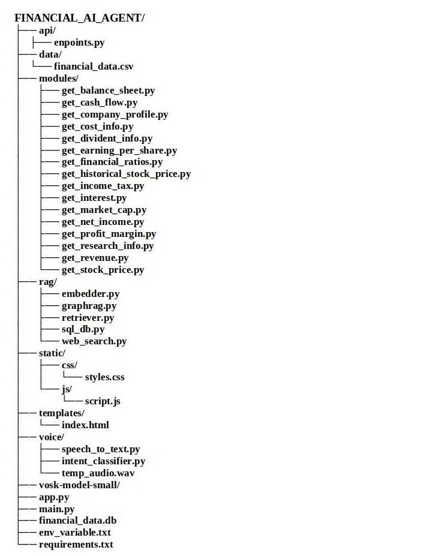

# Documentation of Financial AI Agent
## Overview
The Financial AI Agent is an intelligent system designed to query and retrieve critical financial data from bank and company financial statements using voice recognition. It enables users to access key financial metrics (e.g., net income, revenue) and manage company assets efficiently. The system integrates voice input, natural language processing (NLP), data retrieval from CSV files and the web, and response generation to provide accurate and actionable financial insights. The project is fully functional on a CPU machine.


## Key Features
- **Voice-Activated Financial Queries:** Enables users to query financial data (e.g., net income, revenue) using voice commands, leveraging offline speech recognition with Vosk for privacy and reliability.
- **Multi-Source Data Retrieval:** Seamlessly integrates multiple data sources—Financial Modeling Prep API, local CSV files (financial_data.csv), and web searches via DuckDuckGo—to ensure high availability of financial information.
- **Dynamic Financial Metric Detection:** Automatically identifies financial metrics (e.g., "net income", "revenue") in user queries and tailors searches to retrieve relevant data, supporting a wide range of financial inquiries.
- **RAG Integration with FAISS:** Uses FAISS for efficient similarity search and retrieval of financial documents, enhancing the accuracy and relevance of responses through vector-based search.
- **SQLite Database Integration:** Stores and manages financial data in an SQLite database, enabling efficient querying and persistence of financial metrics and user data.
- **Intelligent Name Entity Recognition:** Maps company names and other metrics to specific symbols using a predefined dictionary or mapping which enhances accuracy by searching financial_data.csv for matches with >= 80% similarity, ensuring robust entity extraction.
- **Privacy-Focused Web Search:** Utilizes duckduckgo_search for web queries, a privacy-focused solution that requires no API key or payment details, making it accessible and secure.
- **Numerical Data Prioritization:** Prioritizes web search results containing numerical values (e.g., "$10.631B") to deliver precise and actionable financial insights to the user.
- **Modular and Extensible Design:** Organized into modular components (speech-to-text, intent classifier, retriever, etc.), allowing easy integration of new data sources or features (e.g., additional financial APIs, global datasets).
- **FastAPI-Powered User Interface:** Provides a modern, asynchronous web interface using FastAPI, allowing users to interact with the financial agent via a browser, view financial data, and visualize reports.


## Project Architecture                      
The Financial AI Agent is structured as a modular system with distinct components, each handling a specific functionality. The architecture follows a pipeline approach: voice input is processed, intent and entities are extracted, data is retrieved from api calling or local directories or web search, and a response is generated for the user.



## Project Mechanism Overview
This project provides an interactive user interface for the Financial AI Agent, developed using FastAPI and Uvicorn. The API allows users to manage the entire codebase and interact with the system for voice-activated financial data retrieval. Below is a detailed explanation of how the system processes user queries:
1. Voice Input & Transcription
- The user initiates voice input by clicking the Start Recording button. Recording continues until the Stop Recording button is pressed.


- Once stopped, the voice input is saved as temp_audio.wav.


- This audio file is sent to speech_to_text.py, which processes the file using the Vosk offline speech recognition model. The transcribe_audio function extracts the textual content and returns it to app.py.


2. Intent Recognition & Module Mapping
- app.py forwards the transcribed text to main.py.


- main.py utilizes the intent_classifier.py script, which applies zero-shot classification using the facebook/bart-large-mnli model to detect the intent behind the query.


- Based on the classified intent, main.py dynamically imports and invokes the corresponding module from the modules/ directory.


- Modules include:
get_net_income.py, get_revenue.py, get_cash_flow.py, get_balance_sheet.py, etc.


- Each module connects to the Financial Modeling Prep (FMP) API to retrieve specific financial data and returns the result to main.py, where it's stored in an output dictionary.


3. RAG-Based Retrieval
- If the RAG (Retrieval-Augmented Generation) option is selected, the system further processes the query:


- It uses spaCy’s en_core_web_lg model for Named Entity Recognition (NER) to identify key components like the organization name, financial metric, and timeline.


- These are stored as key-value pairs and passed to the RAG pipeline.


4. RAG Mechanism:
- Uses all-MiniLM-L6-v2 for embedding both query and dataset entries.


- Applies cosine similarity with FAISS to find relevant matches (≥ 75% similarity).


- If a match is found, the system retrieves contextual data and passes it to the Gemma 2B LLM for generating a natural-language response.


- The final RAG-based response is sent back to main.py and stored alongside the FMP response.


5. Fallback Logic for Robustness
- If the FMP API fails, the RAG pipeline is automatically triggered to retrieve data from local CSV files, Excel sheets, or tabular datasets.


- If both the FMP API and RAG fail, the system invokes web_search.py, which performs a privacy-focused search using DuckDuckGo, prioritizing results with numerical values for accuracy.


- Additionally, an SQL query tool (using sql_db.py) allows structured querying from external data sources by converting them into an SQLite database.


6. Error Handling
Robust error-handling mechanisms are built into every step of the process to ensure the system remains reliable and user-friendly during unexpected failures or incomplete inputs.

## User Interface Overview
Start the Server:  Run app.py using:
```python
uvicorn app:app --reload
```

 - Visit http://127.0.0.1:8000/ in your browser.


- **Start Recording Button:**
 Begins recording the user’s voice. Button toggles to Stop Recording.


- **Stop Recording Button:**
 Ends recording and saves the audio as a .wav file. Automatically sends it for speech-to-text processing.


- **Query Form:**
 Displays the transcribed text. Users can edit the query if needed.


- **Submit Query Button:**
 Sends the processed text to main.py for execution and retrieval.


- **RAG Checkbox:**
 If enabled, combines RAG-based retrieval with API responses for enhanced results.


- **Query Results Section:**
 Displays the final output from the API, RAG module, or web search.


## External Data Sources
### Financial Modeling Prep (FMP)
FMP is the open-source for the most reliable and accurate Stock Market API and Financial Data API. They provides real-time stock prices, financial statements, or historical data or a comprehensive solution to meet all the financial data needs for free.

**API key link:** https://site.financialmodelingprep.com/developer/docs/dashboard
N.B: The provide a free tier of 250 request per day.

**Sample Endpoints:**
- https://financialmodelingprep.com/api/v3/income-statement/{ticker}
- https://financialmodelingprep.com/api/v3/historical-price-full/{ticker}
- https://financialmodelingprep.com/api/v3/balance-sheet-statement/{ticker}

**Financial data sp500 companies.csv (kaggle)**
This dataset represents 500 company's financial statements  based on USA to analyze the company's stock price in the share market. The data is scrapped from the yahoo finance API.

**Dataset link:** https://www.kaggle.com/datasets/pierrelouisdanieau/financial-data-sp500-companies/data

**Data description:**
Each line represents a financial report for a given date.
For each company there are 4 annual reports with 4 different dates:
- 2020-12-31
- 2021-03-31
- 2021-06-30
- 2021-09-30
The columns are :
- firm : company name
- Ticker : company ticker (the symbol)
- Research Development
- Income Before Tax
- Net Income
- Selling General
- Administrative
- Gross Profit
- Ebit
- Operating Income
- Interest Expense
- Income Tax Expense
- Total Revenue
- Total Operating Expenses
- Cost Of Revenue
- Total Other Income Expense Net
- Net Income From Continuing Ops
- Net Income Applicable To Common Shares
